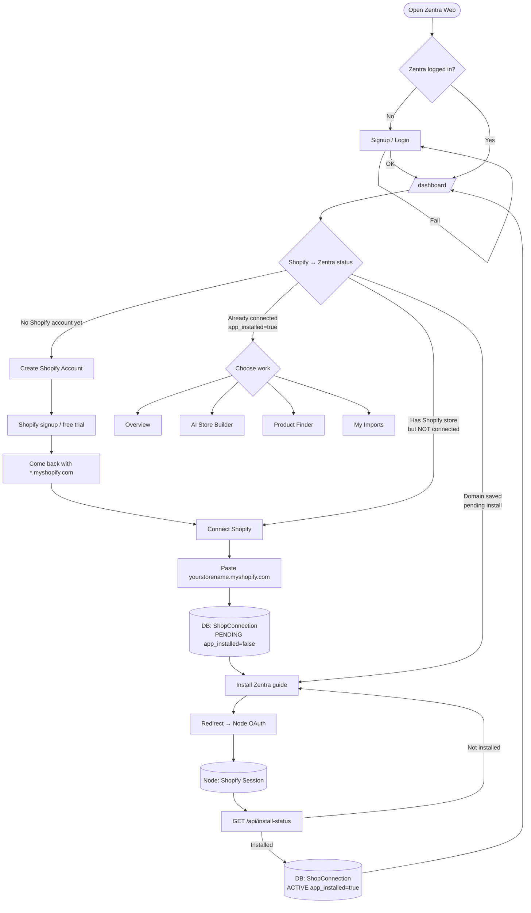
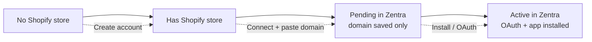
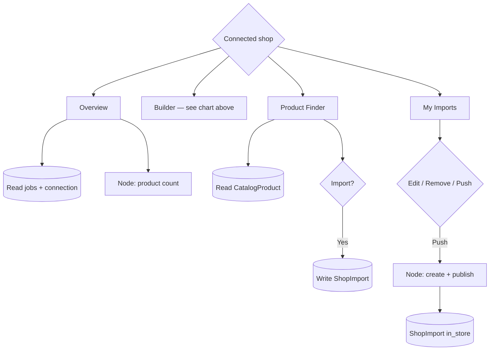
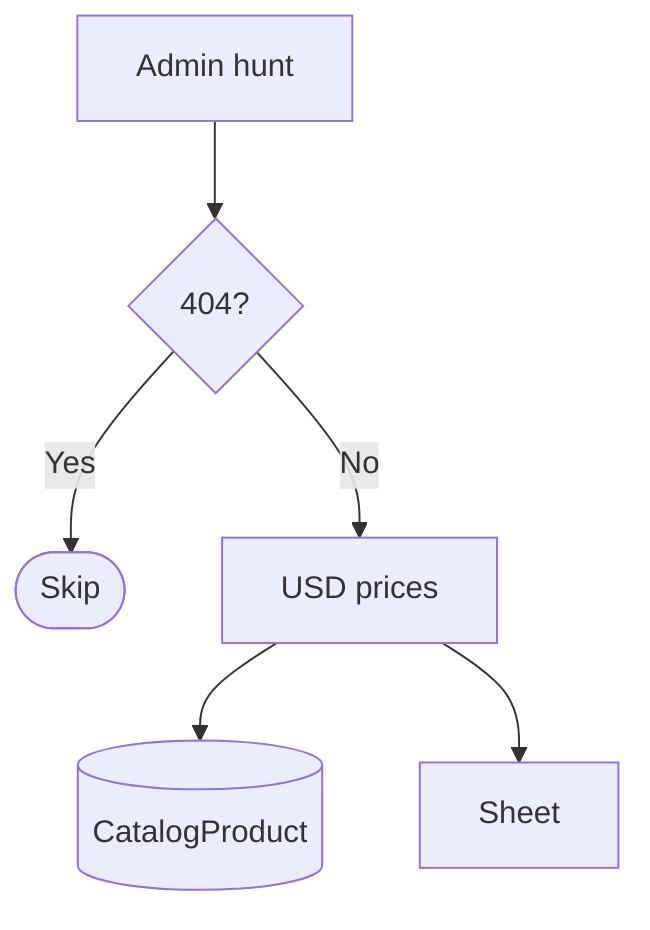
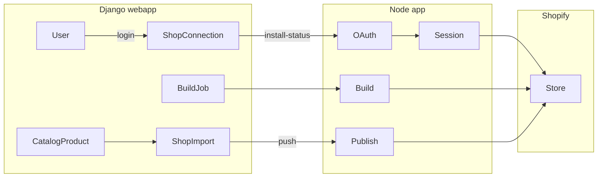

# Zentra-Web workflow charts

Two separate accounts:

1. **Zentra login** = this webapp (`User`)
2. **Shopify store** = merchant’s `*.myshopify.com` (connected via Node OAuth)

---

## Full system (clear store states)



---

## Store status meanings



| Status | Meaning | What user does |
|--------|---------|----------------|
| **No Shopify store** | Never created a Shopify shop | **Create Shopify Account** |
| **Has store, not connected** | Shop exists, Zentra doesn’t know it | **Connect** → paste `*.myshopify.com` |
| **Pending** | Domain in DB, `app_installed=false` | **Install Zentra** (Node OAuth) |
| **Active / connected** | `app_installed=true` | Overview, Builder, Finder Import, Push |

---

## AI Store Builder (full flow)

Requires **Active** connection (`app_installed=true`).

```mermaid
flowchart TD
  Hub[Connected shop] --> Builder[/dashboard/builder/]

  Builder --> Niche[Pick niche NichePack]
  Niche --> Opt{Options?}
  Opt --> Start[Start build]

  Start --> Job[(DB WRITE BuildJob<br/>status=running)]
  Job --> Preview{Staff preview shop?}

  Preview -->|Yes admin-preview-*| Sim[Local timed simulator]
  Preview -->|No real shop| NodeStart[Node POST /api/build/start]
  NodeStart --> Eng[(Node build engine<br/>theme + products)]
  Eng --> Building[/builder/building/id/]

  Sim --> Building
  Building --> Poll[Poll Node GET /api/build/status]
  Poll --> Sync[(DB UPDATE BuildJob<br/>progress / label / step)]
  Sync --> Done{Outcome?}

  Done -->|completed| Success[/builder/success/id/<br/>BuildJob=done]
  Done -->|failed| Fail[build_failed UI<br/>BuildJob=failed]
  Done -->|still running| Building

  Fail --> Retry[Retry]
  Retry --> NodeRetry[Node POST /api/build/retry]
  NodeRetry --> Job
```

| Step | Django | Node |
|------|--------|------|
| Pick niche | `NichePack` UI | optional `GET /api/niches` counts |
| Start | create `BuildJob` | `POST /api/build/start` |
| Progress | building page + poll sync | `GET /api/build/status` → theme/products on Shopify |
| Done / fail | success or failed UI | job completed / failed |
| Retry | new/linked `BuildJob` | `POST /api/build/retry` |

---

## Overview / Finder / Push



---

## Product Hunter → vault (staff)



---

## Who owns what


